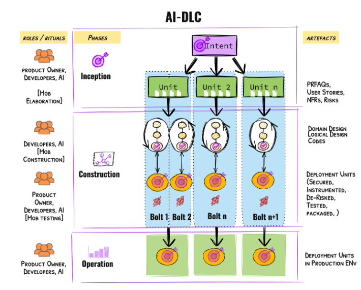
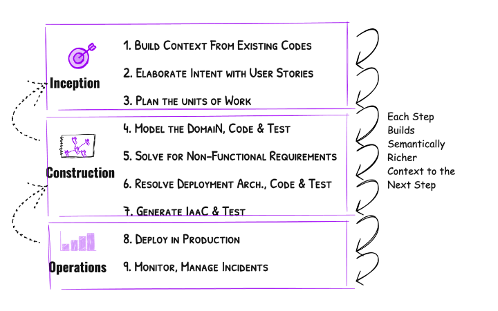
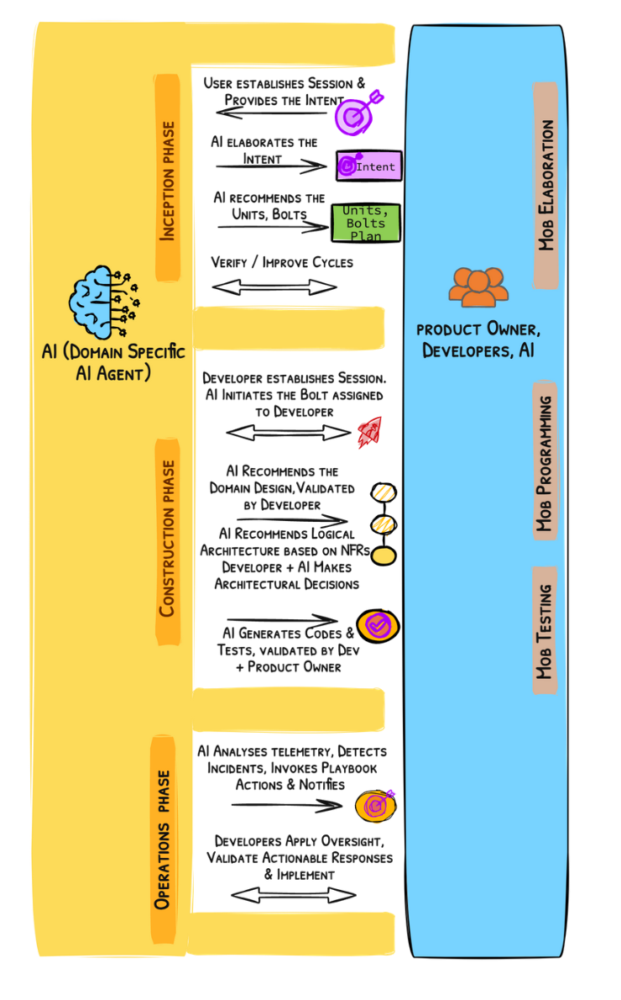

# AI 주도 개발 생명주기 (AI-DLC) 방법론 정의서

**Raja SP, Amazon Web Services**

> **원본 문서:** [AI-Driven Development Lifecycle](https://prod.d13rzhkk8cj2z0.amplifyapp.com/)
>
> **저작권 안내:** 본 문서의 모든 권리는 원 저작자(Raja SP, Amazon Web Services)에게 있습니다. 이 문서는 원본을 한국어로 번역한 것입니다.

---

## I. 배경

소프트웨어 엔지니어링의 진화는 개발자들이 저수준의 차별화되지 않은 작업들을 추상화하여 복잡한 문제 해결에 집중할 수 있도록 하는 지속적인 여정이었습니다. 초기 기계어 코드부터 고수준 프로그래밍 언어, 그리고 API와 라이브러리의 도입까지, 각 단계는 개발자 생산성을 크게 향상시켜 왔습니다. 이제 대규모 언어 모델(LLM)의 통합은 소프트웨어 생성 방식을 혁신하여, 코드 생성, 버그 탐지, 테스트 생성과 같은 작업에 대화형 자연어 상호작용을 도입했습니다. 이것이 바로 AI가 세분화된 특정 작업을 향상시키는 **AI 지원(AI-Assisted)** 시대입니다.

AI가 진화함에 따라, 그 적용 범위는 코드 생성을 넘어 요구사항 정교화, 계획, 작업 분해, 설계, 그리고 개발자와의 실시간 협업으로 확장되고 있습니다. 이러한 변화는 AI가 개발 프로세스를 적극적으로 조율하는 **AI 주도(AI-Driven)** 시대를 열고 있습니다. 그러나 인간 주도의 장기 프로세스를 위해 설계된 기존 소프트웨어 개발 방법론들은 AI의 속도, 유연성, 그리고 고급 역량(예: 에이전틱 기능)과 완전히 부합하지 않습니다. 수동 워크플로우와 경직된 역할 정의에 대한 의존은 AI를 완전히 활용하는 능력을 제한합니다. 이러한 방법론에 AI를 단순히 적용하는 것은 그 잠재력을 제한할 뿐만 아니라 구시대적인 비효율성을 강화합니다. AI의 변혁적 힘을 완전히 활용하려면 SDLC 방법론을 재구상해야 합니다. 이러한 재구상은 AI를 중심 협력자로 두어 워크플로우, 역할, 반복을 조율함으로써 더 빠른 의사결정, 원활한 작업 실행, 지속적인 적응성을 가능하게 해야 합니다.

본 문서는 AI의 역량을 완전히 통합하도록 설계된 재구상된 AI 네이티브 방법론인 **AI 주도 개발 생명주기(AI-DLC)**를 소개하고 정의하여, 소프트웨어 엔지니어링의 다음 진화를 위한 기반을 마련합니다.

---

## II. 핵심 원칙

이 섹션의 원칙들은 AI-DLC를 정의하는 기반을 형성하며, 단계, 역할, 산출물, 의식을 형성합니다. 이러한 가정들은 제안된 방법론을 검증하는 데 중요하며, 그 설계의 근본적인 근거를 제공합니다.

### 1. 개조가 아닌 재구상

우리는 SDLC나 애자일(예: 스크럼)과 같은 기존 방법론을 유지하고 AI를 적용하는 대신 개발 방법론을 재구상하기로 선택했습니다. 이러한 전통적인 방법론들은 더 긴 반복 주기(수개월, 수주)를 위해 구축되어 데일리 스탠드업과 회고와 같은 의식을 낳았습니다. 반면, AI의 적절한 적용은 시간 또는 일 단위로 측정되는 신속한 주기로 이어집니다. 이는 지속적이고 실시간적인 검증과 피드백 메커니즘을 필요로 하며, 많은 전통적인 의식들을 덜 적절하게 만듭니다. AI가 단순, 중간, 어려운 작업 간의 경계를 줄인다면 노력 추정(예: 스토리 포인트)이 그렇게 중요할까요? 속도와 같은 지표가 여전히 적절할까요, 아니면 비즈니스 가치로 대체해야 할까요? 또한 AI는 계획, 작업 분해, 요구사항 분석, 설계 기법 적용(예: 도메인 모델링)을 포함한 수동 관행을 자동화하는 방향으로 점점 진화하여, 의도에서 코드로 이동하는 데 필요한 단계 수를 줄이고 있습니다. 이러한 새로운 역학은 단순한 개조가 아닌 **제1원칙 사고에 기반한 재구상**을 요구합니다. 우리에게 필요한 것은 더 빠른 마차가 아니라 자동차입니다.

### 2. 대화 방향의 역전

AI-DLC는 **AI가 대화를 시작하고 주도**하는 근본적인 전환을 도입합니다. 인간이 작업을 완료하기 위해 AI와 대화를 시작하는 것이 아닙니다. AI는 고수준 의도(예: 새로운 비즈니스 기능 구현)를 실행 가능한 작업으로 분해하고, 권장 사항을 생성하며, 트레이드오프를 제안함으로써 워크플로우를 주도합니다. 인간은 승인자로서 중요한 분기점에서 검증하고, 옵션을 선택하며, 결정을 확인합니다. 이 AI 주도 접근 방식은 AI가 계획, 작업 분해, 자동화를 처리하는 동안 개발자가 고가치 의사결정에 집중할 수 있게 합니다. 전통적인 역학을 역전시킴으로써 AI-DLC는 인간의 참여가 의도적이고 감독, 위험 완화, 전략적 정렬에 집중되도록 보장하여 속도와 품질 모두를 향상시킵니다. 이를 설명하는 비유는 구글 맵스입니다: 인간이 목적지(의도)를 설정하면 시스템이 단계별 안내(AI의 작업 분해와 권장 사항)를 제공합니다. 그 과정에서 인간은 감독을 유지하고 필요에 따라 여정을 조정합니다.

### 3. 설계 기법의 핵심 통합

스크럼이나 칸반과 같은 애자일 프레임워크는 설계 기법(예: 도메인 주도 설계)을 범위 밖에 두고 팀이 자체적으로 선택하도록 권장합니다. 이로 인해 전반적으로 낮은 소프트웨어 품질로 이어지는 중요한 공백이 남았습니다. 미국에서만 소프트웨어 품질 문제로 인한 비용이 2022년에 2.41조 달러로 추정되었습니다([연구](study)). 설계 기법을 분리하는 대신, AI-DLC는 이를 핵심 요소로 통합합니다. 도메인 주도 설계(DDD), 행동 주도 개발(BDD), 또는 테스트 주도 개발(TDD)을 따르는 팀을 위한 다양한 AI-DLC 버전이 있을 것입니다. 본 문서는 DDD 원칙을 사용하여 시스템을 독립적이고 적절한 크기의 바운디드 컨텍스트로 분해하여 병렬로 신속하게 구축할 수 있는 **DDD 버전의 AI-DLC**를 논의합니다. AI는 계획과 작업 분해 중에 이러한 기법을 본질적으로 적용하며, 개발자는 검증하고 조정만 하면 됩니다. 이 통합은 시간별 또는 일별 반복 주기를 가능하게 하면서 수동 작업을 제거하고 소프트웨어 품질을 유지하는 핵심입니다("더 나은 시스템을 더 빠르게 구축"의 만트라).

### 4. AI 역량과의 정렬

본 문서는 AI의 미래 잠재력에 대해 낙관적이지만 현재 상태에 대해서는 완전히 현실적입니다. AI-DLC는 현재 AI가 발전하고 있지만 고수준 의도를 실행 가능한 코드로 자율적으로 번역하거나 해석 가능성과 안전성을 보장하면서 인간의 감독 없이 독립적으로 운영하는 데는 아직 신뢰할 수 없다는 것을 인식합니다. 동시에 개발자가 대부분의 지적 작업을 수행하고 AI가 단순히 증강만 제공하는 AI 지원 패러다임은 개발에서 AI의 전체 잠재력을 해제하지 못합니다. AI-DLC는 인간의 참여와 현재 AI의 역량 및 한계를 균형 있게 조화시키는 **AI 주도 패러다임**을 채택합니다. 이 패러다임에서 개발자는 검증, 의사결정, 감독에 대한 궁극적인 책임을 유지합니다. 이 균형은 AI의 강점을 효과적으로 활용하면서 개발자 판단이 제공하는 중요한 안전장치를 손상시키지 않도록 보장합니다.

### 5. 복잡한 시스템 구축 지원

AI-DLC는 지속적인 기능적 적응성, 높은 아키텍처 복잡성, 수많은 트레이드오프 관리, 확장성, 통합 및 커스터마이징 요구사항이 필요한 시스템 구축을 지원합니다. 이러한 시스템은 고급 설계 기법, 패턴, 모범 사례의 적용을 필요로 하며, 일반적으로 대규모 및/또는 규제된 조직 내에서 여러 팀이 응집력 있게 작업합니다. 비개발자 페르소나가 개발할 수 있고 트레이드오프 관리가 거의 또는 전혀 필요하지 않은 더 단순한 시스템은 AI-DLC의 범위 밖이며 로우코드/노코드 접근 방식에 더 적합합니다.

### 6. 인간 공생을 향상시키는 것 유지

방법론을 재구상하면서, 인간 검증과 위험 완화에 중요한 기존 방법론의 산출물과 접점을 유지할 것입니다. 예를 들어, 사용자 스토리는 무엇을 구축해야 하는지에 대한 인간과 AI의 이해를 정렬하여 잘 정의된 계약으로 작용합니다. 재구상된 방법론에서도 사용자 스토리를 그대로 유지할 것입니다. 또 다른 예는 AI가 생성한 계획과 코드가 조직의 위험 프레임워크를 준수하도록 보장하는 위험 등록부입니다. 이러한 유지된 요소들은 정렬이나 안전성을 손상시키지 않고 신속한 반복을 허용하도록 실시간 사용에 최적화될 것입니다.

### 7. 친숙함을 통한 전환 촉진

새로운 방법론은 광범위한 훈련을 요구하지 않아야 하며 기존 실무자라면 하루 만에 방향을 잡고 실천을 시작할 수 있어야 합니다. 연관 학습을 통한 쉬운 채택을 지원하기 위해, AI-DLC는 현대화된 용어를 도입하면서 이전 방법론의 익숙한 용어 간의 기본 관계를 보존할 것입니다. 예를 들어, 스크럼의 스프린트는 구축과 검증을 위한 반복 주기를 나타냅니다. 하지만 스프린트는 AI 이전 시대에 일반적으로 4~6주였습니다. AI-DLC에서 반복 주기는 연속적이며 시간 또는 일 단위입니다. 따라서 스프린트를 의도적으로 개명해야 합니다. AI-DLC는 스프린트를 **볼트(Bolt)**로 개명하여 전례 없는 속도를 제공하는 신속하고 집중적인 주기를 강조합니다.

### 8. 효율성을 위한 책임 간소화

AI의 작업 분해 및 의사결정 수행 능력을 활용하여, 개발자는 인프라, 프론트엔드, 백엔드, DevOps, 보안과 같은 전통적인 전문화 사일로를 초월할 수 있습니다. 이러한 책임의 수렴은 여러 전문화된 역할의 필요성을 줄이고 개발 프로세스를 간소화합니다. 그러나 제품 소유자와 개발자는 프레임워크의 핵심으로 남아 감독, 검증, 전략적 의사결정에 대한 중요한 책임을 유지합니다. 이러한 역할은 비즈니스 목표와의 정렬을 보장하고, 설계 품질을 유지하며, 위험 관리 프레임워크 준수를 유지하여 자동화와 인간 책임 간의 균형을 보존합니다. 방법론 정의에서 역할을 최소화하여 제1원칙을 고수하며, 추가 역할은 반드시 필요할 때만 도입됩니다.

### 9. 단계 최소화, 흐름 극대화

자동화와 책임의 수렴을 통해 AI-DLC는 핸드오프와 전환을 최소화하여 지속적인 반복 흐름을 가능하게 합니다. 그러나 인간의 검증과 의사결정은 AI가 생성한 코드가 경직되지('급결 시멘트') 않고 향후 반복에 적응 가능하도록 보장하는 데 여전히 중요합니다. 이를 해결하기 위해 AI-DLC는 중요한 의사결정 분기점에서 인간 감독을 위해 특별히 설계된 최소한이지만 충분한 수의 단계를 포함합니다. 이러한 검증은 '손실 함수'의 형태로 작용하여 낭비적인 하류 노력이 발생하기 전에 식별하고 제거합니다.

### 10. 고정된, 편향된 SDLC 워크플로우 없음

AI-DLC는 다양한 개발 경로(신규 시스템 개발, 리팩토링, 결함 수정, 마이크로서비스 확장 등)에 대해 편향된 워크플로우를 규정하는 것을 피합니다. 대신, 주어진 경로 의도에 기반하여 AI가 레벨 1 계획을 권장하는 진정한 **AI 퍼스트 접근 방식**을 채택합니다. 인간은 AI와의 대화형 대화를 통해 이러한 AI 생성 계획을 검증하고 조정하며, 이 프로세스는 레벨 2(하위 작업)와 후속 계층 수준까지 계속됩니다. 작업 실행 수준에서 AI가 작업을 구현하는 동안 인간은 결과의 검증과 확인을 통해 감독을 유지합니다. 이 유연한 접근 방식은 방법론이 중요한 결정에 대한 인간의 통제를 유지하면서 AI 역량과 함께 적응하고 진화할 수 있도록 보장합니다.

---

## III. 핵심 프레임워크

이 섹션은 AI-DLC의 핵심 프레임워크를 설명하며, 단계, 역할, 워크플로우, 주요 산출물을 상세히 다룹니다.



### 1. 산출물

**의도(Intent):** AI-DLC에서 의도는 비즈니스 목표, 기능, 또는 기술적 결과(예: 성능 확장)를 달성해야 하는 것을 캡슐화하는 고수준 목적 선언입니다. 이는 AI 주도 분해의 시작점으로서 인간의 목표와 AI 생성 계획을 정렬합니다.

**유닛(Unit):** 유닛은 측정 가능한 가치를 제공하도록 특별히 설계된 의도에서 파생된 응집력 있고 자체 포함된 작업 요소를 나타냅니다. 예를 들어, 비즈니스 아이디어를 구현하려는 의도는 독립적인 기능 블록을 나타내는 유닛으로 분해될 수 있으며, 이는 DDD의 서브도메인이나 스크럼의 에픽과 유사합니다. 각 유닛은 기능 범위를 명시하는 일련의 작업(이 경우 사용자 스토리)을 포함합니다. AI-DLC의 맥락에서 의도를 유닛으로 분해하는 프로세스는 AI에 의해 주도되며, 개발자 및/또는 제품 소유자가 비즈니스 및 기술 목표와의 정렬을 보장하기 위해 결과 유닛을 검증하고 다듬습니다. 유닛은 느슨하게 결합되어 하류에서 자율적인 개발과 독립적인 배포를 가능하게 합니다.

**볼트(Bolt):** 볼트는 AI-DLC에서 가장 작은 반복으로, 유닛 또는 유닛 내의 작업 집합의 신속한 구현을 위해 설계되었습니다. 볼트(스크럼의 스프린트와 유사)는 집중적인 초점과 고속 전달을 강조하며, 구축-검증 주기가 주 단위가 아닌 시간 또는 일 단위로 측정됩니다. 각 볼트는 잘 정의된 작업 범위(예: 유닛 내의 사용자 스토리 모음)를 캡슐화하여 지원하는 유닛의 전체 목표와 정렬을 유지하면서 점진적인 진행을 가능하게 합니다. 유닛은 하나 이상의 볼트를 통해 실행될 수 있으며, 이는 병렬 또는 순차적으로 실행될 수 있습니다. AI가 볼트를 계획하고 개발자/제품 소유자가 검증합니다.

**도메인 설계(Domain Design):** 도메인 설계 산출물은 인프라 구성 요소와 독립적으로 유닛의 핵심 비즈니스 로직을 모델링합니다. AI-DLC의 첫 번째 버전에서 AI는 도메인 주도 설계 원칙을 사용하여 애그리게이트, 값 객체, 엔티티, 도메인 이벤트, 리포지토리, 팩토리를 포함한 전략적 및 전술적 모델링 요소를 생성합니다.

**논리 설계(Logical Design):** 논리 설계는 적절한 아키텍처 설계 패턴(예: CQRS, 서킷 브레이커 등)의 올바른 선택을 사용하여 비기능적 요구사항을 충족하도록 확장함으로써 도메인 설계를 변환합니다. AI는 개발자의 검증을 위해 아키텍처 결정 기록(ADR)을 생성합니다. 논리 설계 사양을 통해 AI는 적절한 AWS 서비스와 구성요소를 선택하여 잘 설계된 원칙을 준수하면서 코드와 단위 테스트를 생성합니다. 이 단계에서 AI 에이전트는 단위 테스트를 수행하고, 결과를 분석하며, 개발자에게 수정 권장 사항을 제공합니다.

**배포 유닛(Deployment Units):** 배포 유닛은 기능적 수용, 보안, NFR 및 기타 위험에 대해 테스트된 패키징된 실행 코드(예: 쿠버네티스 환경용 컨테이너 이미지, AWS Lambda와 같은 서버리스 함수), 구성(예: Helm 차트), 인프라 구성 요소(예: Terraform 또는 CFN 스택)를 포함하는 운영 산출물입니다. AI는 기능 테스트, 정적 및 동적 보안 테스트, 부하 테스트 시나리오를 포함한 모든 관련 테스트를 생성합니다. 테스트 시나리오와 케이스에 대한 인간의 검증과 조정 후, AI 에이전트는 테스트 스위트를 실행하고, 결과를 분석하며, 실패 지점을 코드 변경, 구성, 또는 기타 종속성과 상관시킵니다. 따라서 이러한 유닛은 기능적 수용, 보안 준수, 비기능적 요구사항(NFR) 준수, 운영 위험 완화에 대해 엄격하게 테스트되어 원활한 배포 준비를 보장합니다.

### 2. 단계 및 의식

**인셉션 단계(Inception Phase):** 인셉션 단계는 의도를 포착하고 개발을 위한 유닛으로 변환하는 데 집중합니다. 이 단계는 협업적 요구사항 정교화 및 분해 의식인 **"몹 엘라보레이션(Mob Elaboration)"**을 사용합니다. 이는 진행자가 이끄는 공유 화면이 있는 단일 방에서 이루어집니다. 몹 엘라보레이션 중에 AI는 도메인 지식과 느슨한 결합 및 높은 응집력의 원칙을 활용하여 의도를 사용자 스토리, 수용 기준, 유닛으로 초기 분해를 제안하는 중심 역할을 합니다. 제품 소유자, 개발자, QA 및 기타 관련 이해관계자(몹)는 이러한 AI 생성 산출물을 협력적으로 검토하고 다듬으며, 과소 설계되거나 과대 설계된 부분을 조정하고 실제 제약 조건에 맞춥니다. 이 단계의 출력에는 잘 정의된 유닛과 다음을 포함하는 각각의 구성 요소가 포함됩니다: a) PRFAQ, b) 사용자 스토리, c) 비기능적 요구사항(NFR) 정의, d) 위험 설명(조직의 위험 등록부와 매칭, 있는 경우), e) 비즈니스 의도를 추적하는 측정 기준, f) 유닛을 구성하는 데 사용할 수 있는 제안된 볼트. 몹 엘라보레이션은 수주 또는 심지어 수개월의 순차적 작업을 몇 시간으로 압축하면서 몹 내부 및 몹과 AI 간의 깊은 정렬을 달성합니다.

**구성 단계(Construction Phase):** 구성 단계는 작업의 반복적 실행을 포함하여 인셉션 단계에서 정의된 유닛을 테스트되고 운영 준비된 배포 유닛으로 변환합니다. 이 단계는 AI가 기술적 고려 사항과 독립적으로 비즈니스 로직을 모델링하는 도메인 설계에서 시작하여, 비기능적 요구사항과 적절한 클라우드 설계 패턴이 적용되는 논리 설계로 진행됩니다. AI는 잘 설계된 원칙을 준수하면서 구성 요소를 적절한 AWS 서비스에 매핑하여 논리 설계에서 상세한 코드를 생성합니다. 이 단계는 기능성, 보안, 운영 준비성을 보장하기 위한 자동화된 테스트로 마무리됩니다. 개발자는 각 단계에서 AI 생성 출력을 검증하고 중요한 결정을 내리는 데 집중하여 각 반복에서 품질과 적응성을 보장합니다. 브라운필드(기존 애플리케이션) 시나리오에서 구성 단계는 먼저 코드를 의미론적으로 풍부한 모델링 표현으로 승격시켜 AI에 대한 컨텍스트가 간결하고 정확해지도록 합니다. 제안된 모델링 표현은 정적 모델(도메인 구성 요소, 책임 및 관계만)과 동적 모델(구성 요소가 중요한 사용 사례를 실현하기 위해 어떻게 상호 작용하는지)입니다.

AI는 이 단계 전반에 걸쳐 중추적인 역할을 하며, 각 작업에서 작업을 권장하고 옵션(설계 패턴, 사용자 경험, 테스트 등)을 제공합니다. AI-DLC는 몹 엘라보레이션과 유사하게 모든 팀이 단일 방에 함께 모여 이를 수행할 것을 권장합니다. 팀은 (도메인 모델 단계에서) 통합 사양을 교환하고, 결정을 내리며, 볼트를 전달합니다. AI-DLC는 이를 **몹 구성(mob-construction)** 의식이라고 부릅니다.

**운영 단계(Operations Phase):** AI-DLC의 운영 단계는 AI를 활용한 운영 효율성을 위해 시스템의 배포, 관찰 가능성, 유지보수에 중점을 둡니다. AI는 메트릭, 로그, 트레이스를 포함한 원격 측정 데이터를 적극적으로 분석하여 패턴을 감지하고, 이상 징후를 식별하며, 잠재적인 SLA 위반을 예측하여 사전 문제 해결을 가능하게 합니다. 또한 AI는 사전 정의된 인시던트 런북과 통합하여 리소스 확장, 성능 튜닝, 결함 격리와 같은 실행 가능한 권장 사항을 제안하고 개발자의 승인 시 해결책을 실행합니다. 개발자는 AI 생성 통찰력과 제안된 조치가 SLA 및 규정 준수 요구사항과 일치하도록 보장하는 검증자 역할을 합니다.

### 3. 워크플로우



비즈니스 의도(예: 그린필드 개발, 브라운필드 향상, 현대화, 또는 결함 수정)가 주어지면, AI-DLC는 의도를 구현하기 위한 워크플로우를 개요하는 레벨 1 계획을 생성하도록 AI에 프롬프트하는 것으로 시작합니다. 이 계획은 초기 제안으로 작용하며, 비즈니스 목표 및 엔지니어링 제약 조건과의 정렬을 보장하기 위해 인간이 투명하게 검토, 검증, 다듬습니다. AI-DLC의 핵심은 각 단계의 산출물을 점진적으로 풍부하게 하여 다음 단계를 위한 의미론적으로 풍부한 컨텍스트로 변환하는 인간 감독을 적용하는 원칙입니다. 각 단계는 인간 감독이 손실 함수처럼 작용하는 전략적 의사결정 지점으로, 오류가 하류로 눈덩이처럼 불어나기 전에 조기에 포착하고 수정합니다. 이것은 재귀적으로 반복됩니다. 레벨 1 계획의 각 단계는 AI에 의해 더 세분화된 실행 가능한 하위 작업으로 추가 분해되며, 다시 정확성과 맥락적 적절성을 보장하기 위해 인간 감독 하에 이루어집니다.

생성된 모든 산출물(의도, 사용자 스토리, 도메인 모델, 또는 테스트 계획)은 지속되며 AI가 생명주기 전반에 걸쳐 참조하는 "컨텍스트 메모리" 역할을 합니다. 전통적인 SDLC 방법론과 마찬가지로 AI-DLC는 본질적으로 반복적이어서 지속적인 개선과 적응을 허용합니다. 또한 모든 산출물이 연결되어 후방 및 전방 추적 가능성(예: 도메인 모델 요소를 특정 사용자 스토리에 연결)을 허용하여 AI가 모든 단계에서 올바르고 가장 관련성 있는 컨텍스트를 검색하도록 보장합니다. 프로세스 전반에 걸쳐 AI는 전략적 계획, 작업 분해, 생성 등을 수행하고 인간은 감독과 검증을 제공합니다.

---

## IV. AI-DLC 실행: 그린필드 개발



제품 소유자가 "교차 판매 제품을 위한 추천 엔진 개발"과 같은 고수준 의도를 명시하며 프로세스를 시작하는 시나리오를 살펴보겠습니다. AI는 이를 새로운 애플리케이션 구축 의도로 인식하고 위 섹션의 워크플로우 단계와 같은 레벨 1 계획을 생성합니다. 팀은 레벨 1 계획의 단계를 검증, 확인하고 추가/수정합니다. 확정된 레벨 1 계획으로 AI는 인셉션 단계로 진행합니다. AI와 상호작용하고 감독을 제공하는 방법은 부록 A의 프롬프트를 참조하세요.

### 1. 인셉션 단계

다음 항목들은 몹 엘라보레이션 의식의 주요 상호작용을 개요합니다.

a. AI가 명확화 질문을 합니다(예: "주요 사용자는 누구입니까? 이것이 달성해야 할 핵심 비즈니스 결과는 무엇입니까?"), 목표에 대한 포괄적인 이해를 보장하고 원래 의도의 모호성을 최소화합니다.

b. AI가 명확화된 의도를 사용자 스토리, 비기능적 요구사항(NFR), 위험 설명으로 정교화합니다. 팀은 이러한 산출물을 검증하고 감독을 제공하며, AI에 필요한 수정 사항을 전달합니다.

c. AI가 높은 응집력을 가진 스토리를 유닛으로 구성합니다. 예: "사용자 데이터 수집", "추천 알고리즘 선택", "API 통합".

d. 제품 소유자가 이러한 출력을 검증하고 필요한 경우 조정하여 유닛을 다듬습니다. 예: 제품 소유자가 사용자 데이터 수집에 개인정보 보호 준수 세부 사항이 부족하다는 것을 발견하고 GDPR 관련 고려 사항을 포함하도록 요구사항을 조정합니다.

e. AI가 모듈에 대한 PRFAQ를 생성합니다(선택 사항), 비즈니스 의도, 기능, 예상 이점을 요약합니다.

f. 개발자와 제품 소유자가 PRFAQ와 관련 위험을 검증하여 전체 목표와의 정렬을 보장합니다.

### 2. 구성 단계

다음 항목들은 이 단계에 포함된 주요 활동을 개요하며, 몹 프로그래밍과 몹 테스팅 의식에 초점을 맞춥니다.

a. 개발자가 AI와 세션을 설정합니다. AI가 개발자에게 할당된 유닛으로 시작하도록 프롬프트합니다.

b. AI가 도메인 주도 설계 원칙을 사용하여 할당된 유닛의 핵심 비즈니스 로직을 모델링합니다. 예: "추천 알고리즘" 유닛의 경우, AI가 Product, Customer, Purchase History와 같은 관련 엔티티와 그 관계를 식별합니다.

c. 개발자가 도메인 모델을 검토하고 검증하며, 비즈니스 로직을 다듬고 실제 시나리오(예: 신규 고객의 구매 이력 누락 처리 방법)와의 정렬을 보장합니다.

d. AI가 도메인 모델을 논리 설계로 변환하여 확장성과 결함 허용과 같은 NFR을 적용합니다. 예: AI가 아키텍처 패턴(예: 이벤트 주도 설계)과 기술(예: 서버리스 컴퓨팅을 위한 AWS Lambda)을 권장합니다.

e. 개발자가 AI의 권장 사항을 평가하고, 트레이드오프를 승인하며, 필요한 경우 추가 고려 사항을 제안합니다(예: 확장성을 위해 Lambda를 수락하지만 더 빠른 쿼리 성능을 위해 스토리지를 DynamoDB로 변경).

f. AI가 각 유닛에 대한 실행 가능한 코드를 생성하여 논리 구성 요소를 특정 AWS 서비스에 매핑합니다.

g. 또한 기능, 보안, 성능 테스트를 자동 생성합니다(예: "추천 알고리즘" 유닛의 경우, AI가 협업 필터링을 구현하고 DynamoDB 데이터 소스와 통합하는 코드를 생성합니다).

h. 개발자가 생성된 코드와 테스트 시나리오/케이스를 검토하고, 품질과 규정 준수를 보장하기 위해 필요한 조정을 합니다.

**테스트 및 검증:**

a. AI가 모든 테스트(기능, 보안, 성능)를 실행하고, 결과를 분석하며, 문제를 강조합니다.

b. 실패한 테스트에 대한 수정을 제안합니다. 예: 더 나은 성능을 위해 쿼리 로직 최적화.

c. 개발자가 AI의 발견 사항을 검증하고, 수정을 승인하며, 필요에 따라 테스트를 다시 실행합니다.

### 3. 운영 단계

**배포:**

a. AI가 모듈을 배포 유닛(예: 컨테이너 이미지, 서버리스 함수)으로 패키징합니다.

b. 개발자가 배포 구성을 승인하고 스테이징 및 프로덕션 환경으로의 롤아웃을 시작합니다.

**관찰 가능성 및 모니터링:**

a. AI가 메트릭, 로그, 트레이스를 분석하여 이상 징후를 식별하고 잠재적인 SLA 위반을 예측합니다. 예: AI가 피크 사용 중 지연 급증을 감지하고 증가된 트래픽을 처리하기 위해 추천 엔진을 확장할 것을 제안합니다.

b. AI가 플레이북과 통합하여 운영 문제에 대한 조치를 제안합니다. API 응답 시간이 저하되면 AI가 DynamoDB 처리량을 늘리거나 API Gateway 트래픽을 재조정할 것을 권장합니다.

c. 개발자가 AI의 권장 사항을 검증하고, 완화 조치를 승인하며, 해결 결과를 모니터링합니다.

---

## V. AI-DLC 실행: 브라운필드 개발

브라운필드는 새로운 기능 추가, 비기능적 요구사항을 위한 최적화, 또는 리팩토링과 결함 수정을 포함한 기술 부채 해결 측면에서 기존 시스템을 변경하는 것을 말합니다. 이 맥락에서 제품 관리자가 기존 애플리케이션에 새로운 기능을 추가해야 하는 시나리오를 살펴보겠습니다.

### 1. 인셉션 단계

브라운필드의 인셉션 단계 활동은 그린필드와 동일합니다.

### 2. 구성 단계

a. AI가 코드를 상위 수준 모델링 표현으로 승격시킵니다. 모델은 정적 모델(구성 요소, 설명, 책임, 관계)과 동적 모델(구성 요소가 가장 중요한 사용 사례를 실현하기 위해 어떻게 상호 작용하는지)로 구성됩니다.

b. 개발자가 제품 관리자와 협력하여 AI가 역공학한 정적 및 동적 모델을 검토, 검증, 수정합니다.

c. 이러한 추가 단계를 통해 나머지 구성 단계는 그린필드 시나리오와 유사합니다.

### 3. 운영 단계

브라운필드의 운영 단계 활동은 그린필드와 동일합니다.

---

## VI. AI-DLC 채택

AI-DLC는 기존 애자일 방법론에서 크게 벗어나지 않으며 쉬운 채택을 핵심 결과로 설계되었습니다. 그러나 전통적인 방법론을 오래 실천해 온 조직과 자체적인 AI 네이티브 방법론 변형을 발명하는 과정에 있는 조직은 AI-DLC를 채택하기 위한 특정 전략이 필요합니다. 다음 2가지 접근 방식이 이를 더 쉽게 만들 것이라고 믿습니다.

a. **실천을 통한 학습** – AI-DLC는 실제로 그룹으로 실천할 수 있는 의식(몹 엘라보레이션, 몹 구성 등)의 집합입니다. 문서와 전통적인 훈련을 통해 방법론을 배우는 대신, 실무자들이 현재 해결 중인 여러 실제 시나리오에서 AI-DLC 가이드와 함께 의식을 실천하도록 합니다. AWS 솔루션 아키텍트들은 대규모 조직에서 하이퍼스케일링 채택을 위해 이 접근 방식을 패키징한 **AI-DLC 유니콘 짐(Unicorn Gym)**이라는 필드 오퍼링을 만들었습니다.

b. **새로운 개발자 경험 도구에 AI-DLC 내장** – 우리 고객들은 SDLC 전반에 걸쳐 개발자에게 통합된 경험을 제공하는 자체 오케스트레이션 도구를 구축하고 있습니다(예: Cognizant의 FlowSource, Aspire의 CodeSpell, HCL의 AIForce 등). 이러한 도구에 AI-DLC를 내장함으로써 대규모 조직의 개발자들은 상당한 채택 추진 없이도 원활하게 AI-DLC를 실천할 수 있습니다.

---

## 부록 A

다음 프롬프트를 사용하여 AI-DLC를 실천하기 위해 AI와 상호작용할 수 있습니다.

### 설정 프롬프트

```
오늘 우리는 애플리케이션을 구축할 것입니다. 모든 프론트엔드와 백엔드 
구성 요소에 대해 프로젝트 폴더를 생성할 것입니다. 모든 문서는 
aidlc-docs 폴더에 저장됩니다. 세션 전반에 걸쳐 나는 당신에게 작업을 
미리 계획하고 계획을 위한 md 파일을 생성하도록 요청할 것입니다. 
내가 해당 계획을 승인한 후에만 작업을 진행할 수 있습니다. 이러한 
계획은 항상 aidlc-docs/plans 폴더에 저장됩니다. 당신은 md 형식으로 
많은 유형의 문서를 생성할 것입니다. 요구사항, 기능 변경 문서는 
aidlc-docs/requirements 폴더에 저장됩니다. 사용자 스토리는 
aidlc-docs/story-artifacts 폴더에 저장해야 합니다. 아키텍처 및 
설계 문서는 aidlc-docs/design-artifacts 폴더에 저장해야 합니다. 
순서대로 모든 프롬프트는 aidlc-docs/prompts.md 파일에 저장됩니다. 
이 프롬프트에 대한 이해를 확인하세요. 아직 존재하지 않는 경우 
저장에 필요한 폴더와 파일을 생성하세요.
```

### 인셉션

#### 사용자 스토리

```
당신의 역할: 당신은 전문 제품 관리자이며 아래 작업 섹션에 언급된 
대로 시스템을 개발하기 위한 계약이 되는 잘 정의된 사용자 스토리를 
작성하는 임무를 맡았습니다. 앞으로의 작업을 계획하고 계획의 각 
단계에 대한 체크박스가 있는 md 파일(user_stories_plan.md)에 
단계를 작성하세요. 어떤 단계에서 내 명확화가 필요하면 내 확인을 
받기 위한 메모를 단계에 추가하세요. 중요한 결정을 스스로 내리지 
마세요. 계획을 완료한 후 내 검토와 승인을 요청하세요. 내 승인 
후에 동일한 계획을 한 단계씩 실행하세요. 각 단계를 완료하면 
계획에서 체크박스를 완료로 표시하세요.

당신의 작업: 여기에 설명된 고수준 요구사항에 대한 사용자 스토리를 
작성하세요 << 제품 설명 기술 >>
```

```
<<<계획을 검토하고 변경한 후>>>>
네, <<md 파일>>의 계획이 마음에 듭니다. 이제 동일한 계획을 
정확히 따르세요. 계획에 명시된 대로 저와 상호작용하세요. 
각 단계를 완료하면 계획에서 체크박스를 표시하세요.
```

#### 유닛

```
당신의 역할: 당신은 경험 많은 소프트웨어 아키텍트입니다. 아래에 
언급된 작업을 시작하기 전에 계획을 수립하고 계획의 각 단계에 대한 
체크박스와 함께 units_plan.md 파일에 단계를 작성하세요. 어떤 
단계에서 내 명확화가 필요하면 저와 상호작용하고 내 확인을 받기 
위해 해당 단계에 추가하세요. 중요한 결정을 스스로 내리지 마세요. 
계획을 생성한 후 내 검토와 승인을 요청하세요. 내 승인 후에 동일한 
계획을 한 단계씩 실행하세요. 각 단계를 완료하면 계획에서 체크박스를 
완료로 표시하세요.

당신의 작업: mvp_user_stories.md 파일의 사용자 스토리를 참조하세요. 
독립적으로 구축할 수 있는 여러 유닛으로 사용자 스토리를 그룹화하세요. 
각 유닛에는 단일 팀이 구축할 수 있는 높은 응집력을 가진 사용자 
스토리가 포함됩니다. 유닛은 서로 느슨하게 결합됩니다. 각 유닛에 
대해 해당 사용자 스토리와 수용 기준을 design/ 폴더의 개별 md 
파일에 작성하세요.
```

```
<<<계획을 검토하고 변경한 후>>>>
승인합니다. 진행하세요.
```

### 구성

#### 도메인(구성 요소) 모델 생성

```
당신의 역할: 당신은 경험 많은 소프트웨어 엔지니어입니다. 아래에 
언급된 작업을 시작하기 전에 계획을 수립하고 계획의 각 단계에 대한 
체크박스와 함께 design/component_model.md 파일에 단계를 
작성하세요. 어떤 단계에서 내 명확화가 필요하면 저와 상호작용하고 
내 확인을 받기 위해 해당 단계에 추가하세요. 중요한 결정을 스스로 
내리지 마세요. 계획을 생성한 후 내 검토와 승인을 요청하세요. 
내 승인 후에 동일한 계획을 한 단계씩 실행하세요. 각 단계를 
완료하면 계획에서 체크박스를 완료로 표시하세요.

당신의 작업: design/seo_optimization_unit.md 파일의 사용자 
스토리를 참조하세요. 모든 사용자 스토리를 구현하기 위한 구성 
요소 모델을 설계하세요. 이 모델에는 모든 구성 요소, 속성, 행동 
및 사용자 스토리를 구현하기 위해 구성 요소가 상호 작용하는 방식이 
포함됩니다. 아직 코드를 생성하지 마세요. 구성 요소 모델을 /design 
폴더의 별도 md 파일에 작성하세요.
```

```
<<<계획을 검토하고 변경한 후>>>>
계획을 승인합니다. 진행하세요. 각 단계를 완료한 후 계획 파일에서 
체크박스를 표시하세요.
```

#### 코드 생성

```
당신의 역할: 당신은 경험 많은 소프트웨어 엔지니어입니다. 아래에 
언급된 작업을 시작하기 전에 계획을 수립하고 계획의 각 단계에 대한 
체크박스와 함께 md 파일에 단계를 작성하세요. 어떤 단계에서 내 
명확화가 필요하면 저와 상호작용하고 내 확인을 받기 위해 해당 
단계에 추가하세요. 중요한 결정을 스스로 내리지 마세요. 계획을 
생성한 후 내 검토와 승인을 요청하세요. 내 승인 후에 동일한 계획을 
한 단계씩 실행하세요. 각 단계를 완료하면 계획에서 체크박스를 완료로 
표시하세요.

작업: search_discovery/nlp_component.md 파일의 구성 요소 설계를 
참조하세요. 설계에 있는 자연어 처리(NLP) 구성 요소에 대한 매우 
간단하고 직관적인 Python 구현을 생성하세요. processQuery(queryText) 
메서드의 경우 Amazon Bedrock API를 사용하여 쿼리 텍스트에서 엔티티를 
추출하세요. 각 개별 파일에 클래스를 생성하되 `vocabMapper` 
디렉토리에 유지하세요.

vocabMapper 디렉토리에 생성된 코드를 참조하세요. EntityExtractor 
구성 요소가 GenAI를 호출하도록 하고 싶습니다. 현재 구현은 로컬 
vocabulary_repository를 사용합니다. 엔티티 추출과 의도 추출 모두에 
GenAI를 활용할 수 있는 방법에 대한 계획을 분석하고 제공해 주세요.
```

#### 아키텍처

```
당신의 역할: 당신은 경험 많은 클라우드 아키텍트입니다. 아래에 
언급된 작업을 시작하기 전에 계획을 수립하고 계획의 각 단계에 
대한 체크박스와 함께 deployment_plan.md 파일에 단계를 작성하세요. 
어떤 단계에서 내 명확화가 필요하면 저와 상호작용하고 내 확인을 
받기 위해 해당 단계에 추가하세요. 중요한 결정을 스스로 내리지 
마세요. 계획을 생성한 후 내 검토와 승인을 요청하세요. 내 승인 
후에 동일한 계획을 한 단계씩 실행하세요. 각 단계를 완료하면 
계획에서 체크박스를 완료로 표시하세요.

작업: 구성 요소 설계 모델: design/core_component_model.md, 
UNITS/ 폴더의 유닛, ARCHITECTURE/ 폴더의 클라우드 아키텍처, 
BACKEND/ 폴더의 백엔드 코드를 참조하세요. 다음을 완료하세요:
- [CloudFormation, CDK, Terraform]을 사용하여 AWS 클라우드에 
  백엔드를 배포하기 위한 엔드투엔드 계획을 생성하세요.
- 배포를 위한 모든 전제 조건을 문서화하세요(있는 경우).

계획을 승인한 후:
- 깔끔하고, 간단하며, 설명 가능한 코딩의 모범 사례를 따르세요.
- 모든 출력 코드는 DEPLOYMENT/ 폴더에 저장하세요.
- 검증 계획을 생성하고 검증 보고서를 생성하여 생성된 코드가 
  의도한 대로 작동하는지 검증하세요.
- 검증 보고서를 검토하고 식별된 모든 문제를 수정하고 검증 
  보고서를 업데이트하세요.
```

#### IaC/Rest API 구축

```
당신의 역할: 당신은 경험 많은 소프트웨어 엔지니어입니다. 아래에 
언급된 작업을 시작하기 전에 계획을 수립하고 계획의 각 단계에 
대한 체크박스와 함께 md 파일에 단계를 작성하세요. 어떤 단계에서 
내 명확화가 필요하면 저와 상호작용하고 내 확인을 받기 위해 해당 
단계에 추가하세요. 중요한 결정을 스스로 내리지 마세요. 계획을 
생성한 후 내 검토와 승인을 요청하세요. 내 승인 후에 동일한 계획을 
한 단계씩 실행하세요. 각 단계를 완료하면 계획에서 체크박스를 완료로 
표시하세요.

작업: construction/<>/ 폴더 아래의 services.py를 참조하세요. 
거기에 있는 각 서비스에 대해 Python Flask API를 생성하세요.
```

---

*Amazon Web Services*
