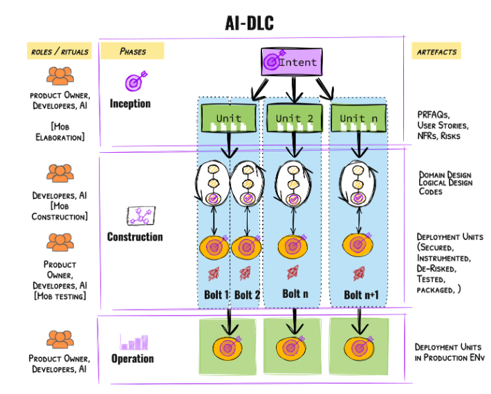
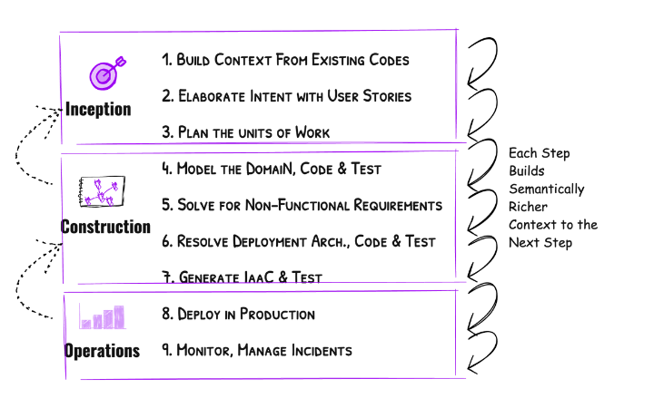
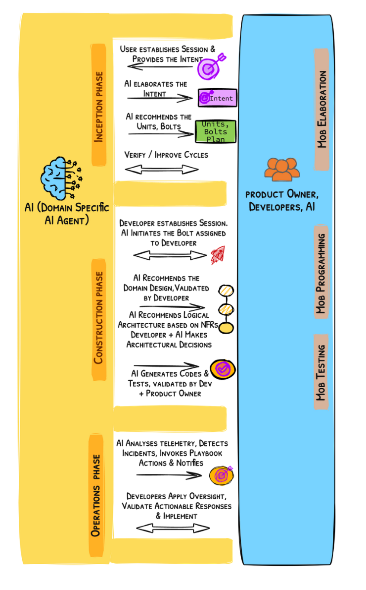

# AI主導開発ライフサイクル (AI-DLC) 方法論定義書

**Raja SP, Amazon Web Services**

> **原文:** [AI-Driven Development Lifecycle](https://prod.d13rzhkk8cj2z0.amplifyapp.com/)
>
> **著作権表示:** 本文書のすべての権利は原著者(Raja SP, Amazon Web Services)に帰属する。本文書は原文を日本語に翻訳したものである。

**言語 / Language:** [한국어](index.md) | **日本語**

---

## I. 背景

ソフトウェアエンジニアリングの進化は、開発者が低レベルの差別化されていない作業を抽象化し、複雑な問題解決に集中できるようにする継続的な旅であった。初期の機械語コードから高水準プログラミング言語、そしてAPIとライブラリの導入まで、各段階は開発者の生産性を大幅に向上させてきた。現在、大規模言語モデル(LLM)の統合は、ソフトウェア生成方式を革新し、コード生成、バグ検出、テスト生成などのタスクに対話型自然言語インタラクションを導入した。これがまさにAIが細分化された特定のタスクを向上させる **AI支援(AI-Assisted)** 時代である。

AIが進化するにつれ、その適用範囲はコード生成を超えて要件精緻化、計画、タスク分解、設計、そして開発者とのリアルタイム協業へと拡張されている。この変化は、AIが開発プロセスを積極的に調整する **AI主導(AI-Driven)** 時代を開いている。しかし、人間主導の長期プロセスのために設計された既存のソフトウェア開発方法論は、AIの速度、柔軟性、そして高度な能力(例: エージェント機能)と完全に整合していない。手動ワークフローと硬直的な役割定義への依存は、AIを完全に活用する能力を制限する。これらの方法論にAIを単純に適用することは、その潜在力を制限するだけでなく、時代遅れの非効率性を強化する。AIの変革的な力を完全に活用するには、SDLC方法論を再構想する必要がある。この再構想は、AIを中心的協力者として位置づけ、ワークフロー、役割、反復を調整することで、より迅速な意思決定、円滑なタスク実行、継続的な適応性を可能にする必要がある。

本文書は、AIの能力を完全に統合するように設計された再構想されたAIネイティブ方法論である **AI主導開発ライフサイクル(AI-DLC)** を紹介し定義することで、ソフトウェアエンジニアリングの次の進化のための基盤を築く。

---

## II. コア原則

本セクションの原則は、AI-DLCを定義する基盤を形成し、フェーズ、役割、成果物、セレモニーを形成する。これらの前提は提案された方法論を検証するために重要であり、その設計の根本的な根拠を提供する。

### 1. 改造ではなく再構想

我々は、SDLCやアジャイル(例: スクラム)などの既存方法論を維持しAIを適用するのではなく、開発方法論を再構想することを選択した。これらの伝統的方法論は、より長い反復サイクル(数ヶ月、数週間)のために構築され、デイリースタンドアップや振り返りなどのセレモニーを生み出した。一方、AIの適切な適用は、時間または日単位で測定される迅速なサイクルにつながる。これは継続的でリアルタイムの検証とフィードバックメカニズムを必要とし、多くの伝統的セレモニーをあまり適切でないものにする。AIが単純、中程度、困難なタスク間の境界を縮小するなら、労力推定(例: ストーリーポイント)はそれほど重要だろうか？ベロシティのような指標は依然として適切か、それともビジネス価値で置き換えるべきか？さらに、AIは計画、タスク分解、要件分析、設計技法の適用(例: ドメインモデリング)を含む手動慣行を自動化する方向へますます進化しており、インテントからコードへ移動するために必要なステップ数を削減している。このような新しいダイナミクスは、単なる改造ではなく **第一原理思考に基づく再構想** を要求する。我々に必要なのは、より速い馬車ではなく、自動車である。

### 2. 対話方向の逆転

AI-DLCは、**AIが対話を開始し主導する** 根本的な転換を導入する。人間がタスクを完了するためにAIと対話を開始するのではない。AIは、高レベルインテント(例: 新しいビジネス機能の実装)を実行可能なタスクに分解し、推奨事項を生成し、トレードオフを提案することでワークフローを主導する。人間は承認者として、重要な分岐点で検証し、オプションを選択し、決定を確認する。このAI主導アプローチは、AIが計画、タスク分解、自動化を処理する間、開発者が高価値の意思決定に集中できるようにする。伝統的なダイナミクスを逆転させることで、AI-DLCは、人間の参加が意図的で、監督、リスク軽減、戦略的整合に集中することを保証し、速度と品質の両方を向上させる。これを説明する比喩はGoogle Mapsである: 人間が目的地(インテント)を設定すると、システムがステップバイステップのガイダンス(AIのタスク分解と推奨事項)を提供する。その過程で、人間は監督を維持し、必要に応じて旅を調整する。

### 3. 設計技法のコア統合

スクラムやカンバンなどのアジャイルフレームワークは、設計技法(例: ドメイン駆動設計)をスコープ外に置き、チームが自ら選択することを推奨する。これにより、全体的に低いソフトウェア品質につながる重要な空白が残された。米国だけでソフトウェア品質問題によるコストは2022年に2.41兆ドルと推定された([研究](study))。設計技法を分離する代わりに、AI-DLCはこれらをコア要素として統合する。ドメイン駆動設計(DDD)、振る舞い駆動開発(BDD)、またはテスト駆動開発(TDD)に従うチームのための様々なAI-DLCバージョンが存在するだろう。本文書は、DDD原則を使用してシステムを独立した適切なサイズのバウンデッドコンテキストに分解し、並行して迅速に構築できる **DDDバージョンのAI-DLC** を論じる。AIは計画とタスク分解中にこれらの技法を本質的に適用し、開発者は検証と調整のみを行えばよい。この統合は、時間別または日別の反復サイクルを可能にしながら、手動作業を排除しソフトウェア品質を維持する鍵である(「より良いシステムをより速く構築」のマントラ)。

### 4. AI能力との整合

本文書は、AIの将来の潜在力について楽観的であるが、現在の状態については完全に現実的である。AI-DLCは、現在AIが進歩しているが、高レベルインテントを実行可能なコードに自律的に翻訳したり、解釈可能性と安全性を保証しながら人間の監督なしで独立して運用することにはまだ信頼できないことを認識する。同時に、開発者がほとんどの知的作業を実行し、AIが単に拡張のみを提供するAI支援パラダイムは、開発におけるAIの全潜在力を解放しない。AI-DLCは、人間の参加と現在のAI能力および限界をバランスよく調和させる **AI主導パラダイム** を採用する。このパラダイムにおいて、開発者は検証、意思決定、監督に対する究極の責任を維持する。このバランスは、AIの強みを効果的に活用しながら、開発者の判断が提供する重要なセーフガードを損なわないことを保証する。

### 5. 複雑なシステム構築の支援

AI-DLCは、継続的な機能的適応性、高いアーキテクチャ複雑性、数多くのトレードオフ管理、拡張性、統合およびカスタマイゼーション要件が必要なシステム構築を支援する。これらのシステムは、高度な設計技法、パターン、ベストプラクティスの適用を必要とし、通常、大規模および/または規制された組織内で複数のチームが結束して作業する。非開発者ペルソナが開発でき、トレードオフ管理がほとんどまたは全く必要ない、よりシンプルなシステムは、AI-DLCのスコープ外であり、ローコード/ノーコードアプローチにより適している。

### 6. 人間共生の向上を維持

方法論を再構想する際、人間検証とリスク軽減に重要な既存方法論の成果物と接点を維持する。例えば、ユーザーストーリーは何を構築すべきかについての人間とAIの理解を整合させ、明確に定義された契約として機能する。再構想された方法論でもユーザーストーリーをそのまま維持する。別の例は、AI生成計画とコードが組織のリスクフレームワークに準拠することを保証するリスク登録簿である。これらの維持された要素は、整合性や安全性を損なうことなく迅速な反復を許可するようにリアルタイム使用に最適化される。

### 7. 親しみやすさを通じた移行促進

新しい方法論は広範なトレーニングを要求すべきではなく、既存の実務者なら一日で方向を掴み実践を開始できるべきである。関連学習を通じた容易な採用を支援するため、AI-DLCは現代化された用語を導入しながら、以前の方法論の馴染みのある用語間の基本的関係を保持する。例えば、スクラムのスプリントは構築と検証のための反復サイクルを表す。しかしスプリントはAI以前の時代には通常4～6週間であった。AI-DLCでは反復サイクルは連続的で時間または日単位である。したがってスプリントを意図的に改名する必要がある。AI-DLCはスプリントを **ボルト(Bolt)** に改名し、前例のない速度を提供する迅速で集中的なサイクルを強調する。

### 8. 効率性のための責任簡素化

AIのタスク分解および意思決定実行能力を活用することで、開発者はインフラ、フロントエンド、バックエンド、DevOps、セキュリティなどの伝統的な専門化サイロを超越できる。この責任の収束は、複数の専門化された役割の必要性を削減し、開発プロセスを合理化する。しかし、プロダクトオーナーと開発者はフレームワークのコアとして残り、監督、検証、戦略的意思決定に対する重要な責任を維持する。これらの役割は、ビジネス目標との整合を保証し、設計品質を維持し、リスク管理フレームワークのコンプライアンスを維持することで、自動化と人間の責任間のバランスを保持する。方法論定義における役割を最小化することで第一原理を遵守し、追加の役割は絶対に必要な場合にのみ導入される。

### 9. フェーズ最小化、フロー最大化

自動化と責任の収束を通じて、AI-DLCはハンドオフと遷移を最小化し、継続的な反復フローを可能にする。しかし、人間の検証と意思決定は、AI生成コードが硬直化('速乾性セメント')せず、将来の反復に適応可能であることを保証するために依然として重要である。これに対処するため、AI-DLCは、重要な意思決定分岐点での人間監督のために特別に設計された最小限だが十分な数のフェーズを含む。これらの検証は「損失関数」の形で機能し、無駄な下流労力が発生する前に識別し除去する。

### 10. 固定された、偏向したSDLCワークフローなし

AI-DLCは、様々な開発経路(新規システム開発、リファクタリング、欠陥修正、マイクロサービス拡張など)に対して偏向したワークフローを規定することを避ける。代わりに、与えられた経路インテントに基づいてAIがレベル1計画を推奨する真の **AIファーストアプローチ** を採用する。人間はAIとの対話的会話を通じてこれらのAI生成計画を検証し調整し、このプロセスはレベル2(サブタスク)および後続の階層レベルまで継続する。タスク実行レベルでは、AIがタスクを実装する間、人間は結果の検証と確認を通じて監督を維持する。この柔軟なアプローチは、方法論が重要な決定に対する人間のコントロールを維持しながら、AI能力とともに適応し進化できることを保証する。

---

## III. コアフレームワーク

本セクションは、AI-DLCのコアフレームワークを説明し、フェーズ、役割、ワークフロー、主要成果物を詳細に扱う。



### 1. 成果物

**インテント(Intent):** AI-DLCにおいてインテントは、ビジネス目標、機能、または技術的結果(例: パフォーマンス拡張)を達成すべきことをカプセル化する高レベル目的宣言である。これはAI主導分解の出発点として、人間の目標とAI生成計画を整合させる。

**ユニット(Unit):** ユニットは、測定可能な価値を提供するように特別に設計されたインテントから派生した、凝集性があり自己完結した作業要素を表す。例えば、ビジネスアイデアを実装するインテントは、独立した機能ブロックを表すユニットに分解できる。これはDDDのサブドメインやスクラムのエピックに類似している。各ユニットは、機能スコープを明示する一連のタスク(この場合ユーザーストーリー)を含む。AI-DLCの文脈において、インテントをユニットに分解するプロセスはAIによって主導され、開発者および/またはプロダクトオーナーがビジネスおよび技術目標との整合を保証するために結果ユニットを検証し洗練する。ユニットは疎結合であり、下流で自律的な開発と独立したデプロイを可能にする。

**ボルト(Bolt):** ボルトは、AI-DLCにおける最小の反復であり、ユニットまたはユニット内のタスクセットの迅速な実装のために設計されている。ボルト(スクラムのスプリントに類似)は、集中的フォーカスと高速配信を強調し、構築-検証サイクルが週単位ではなく時間または日単位で測定される。各ボルトは、明確に定義されたタスクスコープ(例: ユニット内のユーザーストーリーのコレクション)をカプセル化し、サポートするユニットの全体目標との整合を維持しながら、段階的な進行を可能にする。ユニットは1つ以上のボルトを通じて実行でき、これらは並行または順次実行できる。AIがボルトを計画し、開発者/プロダクトオーナーが検証する。

**ドメイン設計(Domain Design):** ドメイン設計成果物は、インフラコンポーネントと独立してユニットのコアビジネスロジックをモデル化する。AI-DLCの最初のバージョンでは、AIはドメイン駆動設計原則を使用して、アグリゲート、値オブジェクト、エンティティ、ドメインイベント、リポジトリ、ファクトリを含む戦略的および戦術的モデリング要素を生成する。

**論理設計(Logical Design):** 論理設計は、適切なアーキテクチャ設計パターン(例: CQRS、サーキットブレーカーなど)の正しい選択を使用して非機能要件を満たすように拡張することで、ドメイン設計を変換する。AIは開発者の検証のためにアーキテクチャ決定記録(ADR)を生成する。論理設計仕様を通じて、AIは適切なAWSサービスとコンポーネントを選択し、Well-Architected原則に準拠しながらコードと単体テストを生成する。この段階でAIエージェントは単体テストを実行し、結果を分析し、開発者に修正推奨事項を提供する。

**デプロイメントユニット(Deployment Units):** デプロイメントユニットは、機能受入、セキュリティ、NFRおよびその他のリスクに対してテストされたパッケージ化された実行コード(例: Kubernetes環境用コンテナイメージ、AWS Lambdaのようなサーバーレス関数)、構成(例: Helmチャート)、インフラコンポーネント(例: TerraformまたはCFNスタック)を含む運用成果物である。AIは、機能テスト、静的および動的セキュリティテスト、負荷テストシナリオを含むすべての関連テストを生成する。テストシナリオとケースに対する人間の検証と調整後、AIエージェントはテストスイートを実行し、結果を分析し、失敗点をコード変更、構成、またはその他の依存関係と相関させる。したがって、これらのユニットは、機能受入、セキュリティコンプライアンス、非機能要件(NFR)コンプライアンス、運用リスク軽減に対して厳密にテストされ、円滑なデプロイ準備を保証する。

### 2. フェーズおよびセレモニー

**インセプションフェーズ(Inception Phase):** インセプションフェーズは、インテントをキャプチャし開発のためのユニットに変換することに集中する。このフェーズは、協調的要件精緻化および分解セレモニーである **"モブエラボレーション(Mob Elaboration)"** を使用する。これはファシリテーターが率いる共有画面のある単一の部屋で行われる。モブエラボレーション中、AIはドメイン知識と疎結合および高凝集の原則を活用し、インテントをユーザーストーリー、受入基準、ユニットへの初期分解を提案する中心的役割を果たす。プロダクトオーナー、開発者、QAおよびその他の関連ステークホルダー(モブ)は、これらのAI生成成果物を協力的にレビューし洗練し、過小設計または過大設計された部分を調整し、実際の制約に適合させる。このフェーズの出力には、明確に定義されたユニットとそれぞれの構成要素が含まれる: a) PRFAQ、b) ユーザーストーリー、c) 非機能要件(NFR)定義、d) リスク記述(組織のリスク登録簿とマッチング、存在する場合)、e) ビジネスインテントを追跡するメトリクス、f) ユニットを構成するために使用できる提案されたボルト。モブエラボレーションは、数週間または数ヶ月の順次作業を数時間に圧縮しながら、モブ内部およびモブとAI間の深い整合を達成する。

**構築フェーズ(Construction Phase):** 構築フェーズは、タスクの反復的実行を含み、インセプションフェーズで定義されたユニットをテストされ運用準備されたデプロイメントユニットに変換する。このフェーズは、AIが技術的考慮事項と独立してビジネスロジックをモデル化するドメイン設計から始まり、非機能要件と適切なクラウド設計パターンが適用される論理設計へと進む。AIは、Well-Architected原則に準拠しながら、コンポーネントを適切なAWSサービスにマッピングし、論理設計から詳細なコードを生成する。このフェーズは、機能性、セキュリティ、運用準備性を保証するための自動化テストで終了する。開発者は各段階でAI生成出力を検証し、重要な決定を行うことに集中し、各反復で品質と適応性を保証する。ブラウンフィールド(既存アプリケーション)シナリオでは、構築フェーズはまずコードを意味論的に豊富なモデリング表現に昇格させ、AIへのコンテキストが簡潔で正確になるようにする。提案されるモデリング表現は、静的モデル(ドメインコンポーネント、責任および関係のみ)と動的モデル(コンポーネントが重要なユースケースを実現するためにどのように相互作用するか)である。

AIはこのフェーズ全体で中枢的役割を果たし、各タスクでタスクを推奨しオプション(設計パターン、ユーザーエクスペリエンス、テストなど)を提供する。AI-DLCは、モブエラボレーションと同様に、すべてのチームが単一の部屋に集まってこれを実行することを推奨する。チームは(ドメインモデル段階で)統合仕様を交換し、決定を下し、ボルトを配信する。AI-DLCはこれを **モブ構築(mob-construction)** セレモニーと呼ぶ。

**運用フェーズ(Operations Phase):** AI-DLCの運用フェーズは、AIを活用した運用効率性のためにシステムのデプロイ、観測可能性、メンテナンスに焦点を置く。AIは、メトリクス、ログ、トレースを含むテレメトリデータを積極的に分析し、パターンを検出し、異常を識別し、潜在的なSLA違反を予測することで、事前問題解決を可能にする。さらに、AIは事前定義されたインシデントランブックと統合し、リソーススケーリング、パフォーマンスチューニング、欠陥分離などの実行可能な推奨事項を提案し、開発者の承認時にソリューションを実行する。開発者は、AI生成インサイトと提案されたアクションがSLAおよびコンプライアンス要件と整合することを保証する検証者の役割を果たす。

### 3. ワークフロー



ビジネスインテント(例: グリーンフィールド開発、ブラウンフィールド拡張、モダナイゼーション、または欠陥修正)が与えられると、AI-DLCは、インテントを実装するためのワークフローを概説するレベル1計画を生成するようAIにプロンプトすることから始まる。この計画は初期提案として機能し、ビジネス目標およびエンジニアリング制約との整合を保証するために人間が透明にレビュー、検証、洗練する。AI-DLCの核心は、各段階の成果物を段階的に豊かにし、次の段階のための意味論的に豊富なコンテキストに変換する人間監督を適用する原則である。各段階は、人間監督が損失関数のように機能する戦略的意思決定ポイントであり、エラーが下流に雪だるま式に拡大する前に早期に捕捉し修正する。これは再帰的に反復される。レベル1計画の各段階は、AIによってさらに細分化された実行可能なサブタスクへと追加分解され、再び正確性と文脈的適切性を保証するために人間監督下で行われる。

生成されたすべての成果物(インテント、ユーザーストーリー、ドメインモデル、またはテストプラン)は永続化され、AIがライフサイクル全体で参照する「コンテキストメモリ」の役割を果たす。伝統的なSDLC方法論と同様に、AI-DLCは本質的に反復的であり、継続的な改善と適応を許可する。さらに、すべての成果物が接続され、後方および前方トレーサビリティ(例: ドメインモデル要素を特定のユーザーストーリーにリンク)を許可し、AIがすべての段階で正しく最も関連性のあるコンテキストを検索することを保証する。プロセス全体を通じて、AIは戦略的計画、タスク分解、生成などを実行し、人間は監督と検証を提供する。

---

## IV. AI-DLC実行: グリーンフィールド開発



プロダクトオーナーが「クロスセル製品のためのレコメンデーションエンジン開発」のような高レベルインテントを明示してプロセスを開始するシナリオを見てみよう。AIはこれを新しいアプリケーション構築インテントとして認識し、上記セクションのワークフロー段階のようなレベル1計画を生成する。チームはレベル1計画の段階を検証、確認し、追加/修正する。確定されたレベル1計画で、AIはインセプションフェーズに進む。AIと相互作用し監督を提供する方法は付録Aのプロンプトを参照されたい。

### 1. インセプションフェーズ

次の項目は、モブエラボレーションセレモニーの主要相互作用を概説する。

a. AIが明確化質問をする(例: "主要ユーザーは誰か？これが達成すべきコアビジネス結果は何か？")。目標に対する包括的理解を保証し、元のインテントの曖昧性を最小化する。

b. AIが明確化されたインテントをユーザーストーリー、非機能要件(NFR)、リスク記述に精緻化する。チームはこれらの成果物を検証し監督を提供し、AIに必要な修正を伝達する。

c. AIが高い凝集性を持つストーリーをユニットに構成する。例: "ユーザーデータ収集"、"レコメンデーションアルゴリズム選択"、"API統合"。

d. プロダクトオーナーがこれらの出力を検証し必要に応じて調整し、ユニットを洗練する。例: プロダクトオーナーがユーザーデータ収集にプライバシーコンプライアンス詳細が不足していることを発見し、GDPR関連考慮事項を含むよう要件を調整する。

e. AIがモジュールに対するPRFAQを生成する(オプション)。ビジネスインテント、機能、予想される利点を要約する。

f. 開発者とプロダクトオーナーがPRFAQと関連リスクを検証し、全体目標との整合を保証する。

### 2. 構築フェーズ

次の項目は、このフェーズに含まれる主要活動を概説し、モブプログラミングとモブテストセレモニーに焦点を当てる。

a. 開発者がAIとセッションを設定する。AIが開発者に割り当てられたユニットで開始するようプロンプトする。

b. AIがドメイン駆動設計原則を使用して、割り当てられたユニットのコアビジネスロジックをモデル化する。例: "レコメンデーションアルゴリズム"ユニットの場合、AIがProduct、Customer、Purchase Historyのような関連エンティティとその関係を識別する。

c. 開発者がドメインモデルをレビューし検証し、ビジネスロジックを洗練し実際のシナリオ(例: 新規顧客の購入履歴欠落処理方法)との整合を保証する。

d. AIがドメインモデルを論理設計に変換し、拡張性と障害許容のようなNFRを適用する。例: AIがアーキテクチャパターン(例: イベント駆動設計)と技術(例: サーバーレスコンピューティングのためのAWS Lambda)を推奨する。

e. 開発者がAIの推奨事項を評価し、トレードオフを承認し、必要に応じて追加考慮事項を提案する(例: 拡張性のためにLambdaを受け入れるが、より速いクエリパフォーマンスのためにストレージをDynamoDBに変更)。

f. AIが各ユニットに対する実行可能なコードを生成し、論理コンポーネントを特定のAWSサービスにマッピングする。

g. また、機能、セキュリティ、パフォーマンステストを自動生成する(例: "レコメンデーションアルゴリズム"ユニットの場合、AIが協調フィルタリングを実装しDynamoDBデータソースと統合するコードを生成する)。

h. 開発者が生成されたコードとテストシナリオ/ケースをレビューし、品質とコンプライアンスを保証するために必要な調整を行う。

**テストおよび検証:**

a. AIがすべてのテスト(機能、セキュリティ、パフォーマンス)を実行し、結果を分析し、問題を強調表示する。

b. 失敗したテストに対する修正を提案する。例: より良いパフォーマンスのためにクエリロジックを最適化。

c. 開発者がAIの発見を検証し、修正を承認し、必要に応じてテストを再実行する。

### 3. 運用フェーズ

**デプロイ:**

a. AIがモジュールをデプロイメントユニット(例: コンテナイメージ、サーバーレス関数)としてパッケージ化する。

b. 開発者がデプロイ構成を承認し、ステージングおよびプロダクション環境へのロールアウトを開始する。

**観測可能性およびモニタリング:**

a. AIがメトリクス、ログ、トレースを分析し、異常を識別し、潜在的なSLA違反を予測する。例: AIがピーク使用中の遅延急増を検出し、増加したトラフィックを処理するためにレコメンデーションエンジンをスケーリングすることを提案する。

b. AIがプレイブックと統合し、運用問題に対するアクションを提案する。API応答時間が低下すると、AIがDynamoDBスループットを増やすか、API Gatewayトラフィックを再調整することを推奨する。

c. 開発者がAIの推奨事項を検証し、軽減アクションを承認し、解決結果をモニタリングする。

---

## V. AI-DLC実行: ブラウンフィールド開発

ブラウンフィールドは、新機能追加、非機能要件のための最適化、またはリファクタリングと欠陥修正を含む技術的負債解決の観点で既存システムを変更することを指す。この文脈で、プロダクトマネージャーが既存アプリケーションに新機能を追加する必要があるシナリオを見てみよう。

### 1. インセプションフェーズ

ブラウンフィールドのインセプションフェーズ活動は、グリーンフィールドと同一である。

### 2. 構築フェーズ

a. AIがコードを上位レベルモデリング表現に昇格させる。モデルは静的モデル(コンポーネント、説明、責任、関係)と動的モデル(コンポーネントが最も重要なユースケースを実現するためにどのように相互作用するか)で構成される。

b. 開発者がプロダクトマネージャーと協力し、AIがリバースエンジニアリングした静的および動的モデルをレビュー、検証、修正する。

c. これらの追加ステップを通じて、残りの構築フェーズはグリーンフィールドシナリオと類似している。

### 3. 運用フェーズ

ブラウンフィールドの運用フェーズ活動は、グリーンフィールドと同一である。

---

## VI. AI-DLC採用

AI-DLCは既存のアジャイル方法論から大きく逸脱しておらず、容易な採用をコア結果として設計されている。しかし、伝統的方法論を長く実践してきた組織と、独自のAIネイティブ方法論変種を発明する過程にある組織は、AI-DLCを採用するための特定の戦略が必要である。次の2つのアプローチがこれをより容易にすると信じている。

a. **実践を通じた学習** – AI-DLCは実際にグループで実践できるセレモニー(モブエラボレーション、モブ構築など)の集合である。文書と伝統的トレーニングを通じて方法論を学ぶ代わりに、実務者が現在解決中の複数の実際のシナリオでAI-DLCガイドと共にセレモニーを実践するようにする。AWSソリューションアーキテクトは、大規模組織でのハイパースケーリング採用のためにこのアプローチをパッケージ化した **AI-DLC ユニコーンジム(Unicorn Gym)** というフィールドオファリングを作成した。

b. **新しい開発者エクスペリエンスツールへのAI-DLC組み込み** – 我々の顧客は、SDLC全体で開発者に統合されたエクスペリエンスを提供する独自のオーケストレーションツールを構築している(例: CognizantのFlowSource、AspireのCodeSpell、HCLのAIForceなど)。これらのツールにAI-DLCを組み込むことで、大規模組織の開発者は相当な採用推進なしでシームレスにAI-DLCを実践できる。

---

## 付録 A

次のプロンプトを使用してAI-DLCを実践するためにAIと相互作用できる。

### セットアッププロンプト

```
今日我々はアプリケーションを構築する。すべてのフロントエンドとバックエンド
コンポーネントに対してプロジェクトフォルダを作成する。すべてのドキュメントは
aidlc-docsフォルダに保存される。セッション全体を通じて私はあなたにタスクを
事前に計画し計画のためのmdファイルを生成するよう要求する。
私がその計画を承認した後にのみタスクを進めることができる。これらの
計画は常にaidlc-docs/plansフォルダに保存される。あなたはmd形式で
多くのタイプのドキュメントを生成する。要件、機能変更ドキュメントは
aidlc-docs/requirementsフォルダに保存される。ユーザーストーリーは
aidlc-docs/story-artifactsフォルダに保存する必要がある。アーキテクチャおよび
設計ドキュメントはaidlc-docs/design-artifactsフォルダに保存する必要がある。
順序ですべてのプロンプトはaidlc-docs/prompts.mdファイルに保存される。
このプロンプトに対する理解を確認せよ。まだ存在しない場合
保存に必要なフォルダとファイルを作成せよ。
```

### インセプション

#### ユーザーストーリー

```
あなたの役割: あなたは専門プロダクトマネージャーであり、以下のタスクセクションに言及された
ようにシステムを開発するための契約となる明確に定義されたユーザーストーリーを
作成する任務を負っている。今後の作業を計画し、計画の各
ステップに対するチェックボックスがあるmdファイル(user_stories_plan.md)に
ステップを記述せよ。どのステップで私の明確化が必要な場合、私の確認を
得るためのメモをステップに追加せよ。重要な決定を自ら下すな。
計画を完了した後、私のレビューと承認を要求せよ。私の承認
後に同じ計画を一ステップずつ実行せよ。各ステップを完了したら
計画でチェックボックスを完了としてマークせよ。

あなたのタスク: ここに記述された高レベル要件に対するユーザーストーリーを
作成せよ << 製品説明記述 >>
```

```
<<<計画をレビューし変更した後>>>>
はい、<<mdファイル>>の計画が気に入った。今同じ計画を
正確に従え。計画に明示されたように私と相互作用せよ。
各ステップを完了したら計画でチェックボックスをマークせよ。
```

#### ユニット

```
あなたの役割: あなたは経験豊富なソフトウェアアーキテクトである。以下に
言及されたタスクを開始する前に計画を立て、計画の各ステップに対する
チェックボックスと共にunits_plan.mdファイルにステップを記述せよ。どの
ステップで私の明確化が必要な場合、私と相互作用し私の確認を得るために
そのステップに追加せよ。重要な決定を自ら下すな。
計画を生成した後、私のレビューと承認を要求せよ。私の承認後に同じ
計画を一ステップずつ実行せよ。各ステップを完了したら計画でチェックボックスを
完了としてマークせよ。

あなたのタスク: mvp_user_stories.mdファイルのユーザーストーリーを参照せよ。
独立して構築できる複数のユニットにユーザーストーリーをグループ化せよ。
各ユニットには単一のチームが構築できる高い凝集性を持つユーザー
ストーリーが含まれる。ユニットは互いに疎結合である。各ユニットに
対してそのユーザーストーリーと受入基準をdesign/フォルダの個別md
ファイルに記述せよ。
```

```
<<<計画をレビューし変更した後>>>>
承認する。進めよ。
```

### 構築

#### ドメイン(コンポーネント)モデル生成

```
あなたの役割: あなたは経験豊富なソフトウェアエンジニアである。以下に
言及されたタスクを開始する前に計画を立て、計画の各ステップに対する
チェックボックスと共にdesign/component_model.mdファイルにステップを
記述せよ。どのステップで私の明確化が必要な場合、私と相互作用し
私の確認を得るためにそのステップに追加せよ。重要な決定を自ら
下すな。計画を生成した後、私のレビューと承認を要求せよ。
私の承認後に同じ計画を一ステップずつ実行せよ。各ステップを
完了したら計画でチェックボックスを完了としてマークせよ。

あなたのタスク: design/seo_optimization_unit.mdファイルのユーザー
ストーリーを参照せよ。すべてのユーザーストーリーを実装するためのコンポーネント
モデルを設計せよ。このモデルにはすべてのコンポーネント、属性、振る舞い
およびユーザーストーリーを実装するためにコンポーネントが相互作用する方式が
含まれる。まだコードを生成するな。コンポーネントモデルを/design
フォルダの別個のmdファイルに記述せよ。
```

```
<<<計画をレビューし変更した後>>>>
計画を承認する。進めよ。各ステップを完了した後、計画ファイルで
チェックボックスをマークせよ。
```

#### コード生成

```
あなたの役割: あなたは経験豊富なソフトウェアエンジニアである。以下に
言及されたタスクを開始する前に計画を立て、計画の各ステップに対する
チェックボックスと共にmdファイルにステップを記述せよ。どのステップで私の
明確化が必要な場合、私と相互作用し私の確認を得るためにそのステップに
追加せよ。重要な決定を自ら下すな。計画を
生成した後、私のレビューと承認を要求せよ。私の承認後に同じ計画を
一ステップずつ実行せよ。各ステップを完了したら計画でチェックボックスを完了として
マークせよ。

タスク: search_discovery/nlp_component.mdファイルのコンポーネント設計を
参照せよ。設計にある自然言語処理(NLP)コンポーネントに対して非常に
簡単で直感的なPython実装を生成せよ。processQuery(queryText)
メソッドの場合、Amazon Bedrock APIを使用してクエリテキストからエンティティを
抽出せよ。各個別ファイルにクラスを生成するが、`vocabMapper`
ディレクトリに維持せよ。

vocabMapperディレクトリに生成されたコードを参照せよ。EntityExtractor
コンポーネントがGenAIを呼び出すようにしたい。現在の実装はローカル
vocabulary_repositoryを使用する。エンティティ抽出と意図抽出の両方に
GenAIを活用できる方法に関する計画を分析し提供せよ。
```

#### アーキテクチャ

```
あなたの役割: あなたは経験豊富なクラウドアーキテクトである。以下に
言及されたタスクを開始する前に計画を立て、計画の各ステップに
対するチェックボックスと共にdeployment_plan.mdファイルにステップを記述せよ。
どのステップで私の明確化が必要な場合、私と相互作用し私の確認を
得るためにそのステップに追加せよ。重要な決定を自ら下すな。
計画を生成した後、私のレビューと承認を要求せよ。私の承認
後に同じ計画を一ステップずつ実行せよ。各ステップを完了したら
計画でチェックボックスを完了としてマークせよ。

タスク: コンポーネント設計モデル: design/core_component_model.md、
UNITS/フォルダのユニット、ARCHITECTURE/フォルダのクラウドアーキテクチャ、
BACKEND/フォルダのバックエンドコードを参照せよ。次を完了せよ:
- [CloudFormation, CDK, Terraform]を使用してAWSクラウドに
  バックエンドをデプロイするためのエンドツーエンド計画を生成せよ。
- デプロイのためのすべての前提条件を文書化せよ(存在する場合)。

計画を承認した後:
- きれいで、シンプルで、説明可能なコーディングのベストプラクティスに従え。
- すべての出力コードはDEPLOYMENT/フォルダに保存せよ。
- 検証計画を生成し検証レポートを生成して生成されたコードが
  意図したように動作するか検証せよ。
- 検証レポートをレビューし識別されたすべての問題を修正し検証
  レポートを更新せよ。
```

#### IaC/Rest API構築

```
あなたの役割: あなたは経験豊富なソフトウェアエンジニアである。以下に
言及されたタスクを開始する前に計画を立て、計画の各ステップに
対するチェックボックスと共にmdファイルにステップを記述せよ。どのステップで
私の明確化が必要な場合、私と相互作用し私の確認を得るためにそのステップに
追加せよ。重要な決定を自ら下すな。計画を
生成した後、私のレビューと承認を要求せよ。私の承認後に同じ計画を
一ステップずつ実行せよ。各ステップを完了したら計画でチェックボックスを完了として
マークせよ。

タスク: construction/<>/フォルダ下のservices.pyを参照せよ。
そこにある各サービスに対してPython Flask APIを生成せよ。
```

---

*Amazon Web Services*
